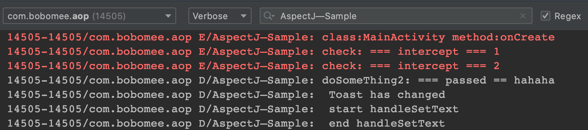

# Android Aop 方案 AspectJ使用实例
---




# gradle 插件
---

引入方式：

- project.build.gradle

```groovy
buildscript {
    repositories {
        repositories {
            maven { url uri('./repo')}
            //...
        }
    }
    dependencies {
        classpath "com.android.tools.build:gradle:7.0.2"
        classpath "com.bobomee.plugin:aop:1.0.0"
    }
}
```

- application.build.gradle

```groovy
repositories {
    maven { url uri('../repo')}
}

plugins {
    id 'com.android.application'
    id 'aop'
}

implementation 'com.bobomee.aop:annotation:1.0.0'
implementation 'com.bobomee.aop:runtime:1.0.0'
```

# 参考blog
---

[Android切面编程AOP之AspectJ的使用](https://blog.csdn.net/wbwjx/article/details/121881427)
